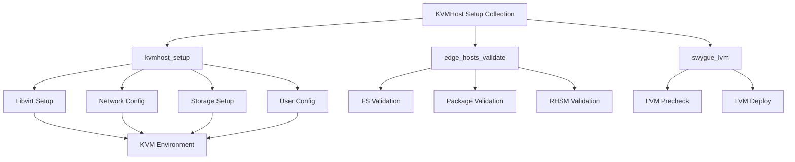

# Qubinode kvmhost Setup Collection for Ansible
This Ansible Collection for Virtual Machines Setup provides a set of roles for configuring and managing KVM hosts in baremetal servers using RHEL-based Linux operating systems. This collection can help to simplify the process of deploying and managing virtual machines by automating the setup process.


Role Variables
--------------

| variable  | definition |
| ------------- | ------------- |
| project_dir | location of code and qcow iamge | 
| required_rpm_pakcages | list of packages that will be installed |
| libvirt_services | libvirt services |
| libvirt_host_networks | dictionary variable that creates libvirt network xml file. must set the name, mode, and bridge key |
| libvirt_host_pool | Content Cell  |
| kvm_host_ipaddr | default value is ansible_default_ipv4.address  |
| kvm_host_ip | default value is ansible_default_ipv4.address |
| kvm_host_interface | default value is ansible_default_ipv4.interface |
| kvm_host_gw | default value is ansible_default_ipv4.gateway |
| kvm_host_macaddr | default value is ansible_default_ipv4.mac |
| kvm_host_netmask | default value is ansible_default_ipv4.netmask |
| kvm_host_mask_prefix | default value is ansible_default_ipv4.gateway |
| kvm_host_bootproto | default value is dhcp |
| kvm_bridge_type | default value is Bridge |
| storage_nic | default value is false |
| libvirt_disk | default value is false |
| qubinode_bridge_name | default qubibr0 name of bridge network |
| qubinode_bridge_fact | name of bridge to check ansible_qubibr0.active for active status |
| qcow_rhel_name | name of default qcow image |
| admin_user | ssh username for kvm server |
| kvm_host_domain | default value is "lab.example" |
| kvm_host_dns_server | default value is  "1.1.1.1"  |
| dns_servers | default value is"{{ dns_server }}" and 8.8.8.8 |
| kvm_host_libvirt_dir | default value is /var/lib/libvirt/images |
| configure_bridge | set to false to skip creating a bridge interface |
| configure_shell | Configure the user bash shell login prompt |
| cockpit_packages | default packages for cockpit |
| cicd_test | set to true to test in container |

# Collection directories and files Reference 
https://docs.ansible.com/ansible/latest/dev_guide/developing_collections_structure.html#collection-directories-and-files
```
collection/
├── docs/
├── galaxy.yml
├── meta/
│   └── runtime.yml
├── plugins/
│   ├── modules/
│   │   └── module1.py
│   ├── inventory/
│   └── .../
├── README.md
├── roles/
│   ├── role1/
│   ├── role2/
│   └── .../
├── playbooks/
│   ├── files/
│   ├── vars/
│   ├── templates/
│   └── tasks/
└── tests/
```


<!-- Describe the collection and why a user would want to use it. What does the collection do? -->

## Code of Conduct

We follow the [Ansible Code of Conduct](https://docs.ansible.com/ansible/devel/community/code_of_conduct.html) in all our interactions within this project.

If you encounter abusive behavior, please refer to the [policy violations](https://docs.ansible.com/ansible/devel/community/code_of_conduct.html#policy-violations) section of the Code for information on how to raise a complaint.

## Communication

<!--List available communication channels. In addition to channels specific to your collection, we also recommend to use the following ones.-->

We announce releases and important changes through Ansible's [The Bullhorn newsletter](https://github.com/ansible/community/wiki/News#the-bullhorn). Be sure you are [subscribed](https://eepurl.com/gZmiEP).

Join us in the `#ansible` (general use questions and support), `#ansible-community` (community and collection development questions), and other [IRC channels](https://docs.ansible.com/ansible/devel/community/communication.html#irc-channels).

We take part in the global quarterly [Ansible Contributor Summit](https://github.com/ansible/community/wiki/Contributor-Summit) virtually or in-person. Track [The Bullhorn newsletter](https://eepurl.com/gZmiEP) and join us.

For more information about communication, refer to the [Ansible Communication guide](https://docs.ansible.com/ansible/devel/community/communication.html).

## Contributing to this collection

<!--Describe how the community can contribute to your collection. At a minimum, fill up and include the CONTRIBUTING.md file containing how and where users can create issues to report problems or request features for this collection. List contribution requirements, including preferred workflows and necessary testing, so you can benefit from community PRs. If you are following general Ansible contributor guidelines, you can link to - [Ansible Community Guide](https://docs.ansible.com/ansible/devel/community/index.html). List the current maintainers (contributors with write or higher access to the repository). The following can be included:-->

The content of this collection is made by people like you, a community of individuals collaborating on making the world better through developing automation software.

We are actively accepting new contributors.

Any kind of contribution is very welcome.

You don't know how to start? Refer to our [contribution guide](CONTRIBUTING.md)!

We use the following guidelines:

* [CONTRIBUTING.md](CONTRIBUTING.md)
* [REVIEW_CHECKLIST.md](REVIEW_CHECKLIST.md)
* [Ansible Community Guide](https://docs.ansible.com/ansible/latest/community/index.html)
* [Ansible Development Guide](https://docs.ansible.com/ansible/devel/dev_guide/index.html)
* [Ansible Collection Development Guide](https://docs.ansible.com/ansible/devel/dev_guide/developing_collections.html#contributing-to-collections)

## Collection maintenance

The current maintainers are listed in the [MAINTAINERS](MAINTAINERS) file. If you have questions or need help, feel free to mention them in the proposals.

To learn how to maintain / become a maintainer of this collection, refer to the [Maintainer guidelines](MAINTAINING.md).

## Governance

<!--Describe how the collection is governed. Here can be the following text:-->

The process of decision making in this collection is based on discussing and finding consensus among participants.

Every voice is important. If you have something on your mind, create an issue or dedicated discussion and let's discuss it!

## Tested with Ansible

<!-- List the versions of Ansible the collection has been tested with. Must match what is in galaxy.yml. -->

## External requirements

<!-- List any external resources the collection depends on, for example minimum versions of an OS, libraries, or utilities. Do not list other Ansible collections here. -->

### Supported connections
<!-- Optional. If your collection supports only specific connection types (such as HTTPAPI, netconf, or others), list them here. -->

## Included content

<!-- Galaxy will eventually list the module docs within the UI, but until that is ready, you may need to either describe your plugins etc here, or point to an external docsite to cover that information. -->

## Using this collection

<!--Include some quick examples that cover the most common use cases for your collection content. It can include the following examples of installation and upgrade (change qubinode.qubinode_kvmhost_setup_collection correspondingly):-->

## Testing and CI/CD

For detailed testing instructions, see our [Testing Guide](testing.md). This includes:

- Prerequisites and setup
- Molecule testing
- Integration testing
- CI/CD pipeline configuration
- Container-based testing
- Troubleshooting tips

The collection includes comprehensive testing through GitHub Actions CI/CD pipelines, supporting:
- Ansible: 2.13, 2.14, 2.15
- Python: 3.9 and 3.10

### Automated Ansible Lint Fixes with AI Assistance

This collection features an advanced automated lint fixing workflow that leverages Google Gemini AI for intelligent code analysis and fixes. The workflow provides three modes:

#### Fix Modes:
- **Auto**: Standard ansible-lint auto-fix functionality
- **Manual Review**: Generates detailed reports for manual intervention
- **Gemini-assisted**: AI-powered analysis and prioritized fix recommendations

#### Usage:
1. Navigate to the repository's Actions tab
2. Select "Automated Ansible Lint Fixes with Gemini"
3. Click "Run workflow" and choose your preferred fix mode
4. The workflow will create a pull request with fixes if issues are found

#### Required Secrets:
To use Gemini-assisted mode, add your Google Gemini API key as a repository secret:
- Secret name: `GEMINI_API_KEY`
- Obtain from: [Google AI Studio](https://aistudio.google.com/app/apikey)

#### Benefits:
- **Intelligent Prioritization**: AI analyzes issues by criticality
- **Best Practice Compliance**: Ensures fixes follow Ansible conventions
- **Breaking Change Detection**: Identifies potential compatibility issues
- **Automated PR Creation**: Creates detailed pull requests with context

The AI assistant provides expert-level analysis of ansible-lint issues, recommending fix strategies that align with Ansible best practices while maintaining backwards compatibility.


### Installing the Collection from Ansible Galaxy

Before using this collection, you need to install it with the Ansible Galaxy command-line tool:
```bash
ansible-galaxy collection install qubinode.qubinode_kvmhost_setup_collection
```

You can also include it in a `requirements.yml` file and install it with `ansible-galaxy collection install -r requirements.yml`, using the format:
```yaml
---
collections:
  - name: qubinode.qubinode_kvmhost_setup_collection
```

Note that if you install the collection from Ansible Galaxy, it will not be upgraded automatically when you upgrade the `ansible` package. To upgrade the collection to the latest available version, run the following command:
```bash
ansible-galaxy collection install qubinode.qubinode_kvmhost_setup_collection --upgrade
```

You can also install a specific version of the collection, for example, if you need to downgrade when something is broken in the latest version (please report an issue in this repository). Use the following syntax to install version `0.1.0`:

```bash
ansible-galaxy collection install qubinode.qubinode_kvmhost_setup_collection:==0.1.0
```

See [Ansible Using collections](https://docs.ansible.com/ansible/devel/user_guide/collections_using.html) for more details.

## Release notes

See the [changelog](https://github.com/ansible-collections/REPONAMEHERE/tree/main/CHANGELOG.rst).

## Roadmap

<!-- Optional. Include the roadmap for this collection, and the proposed release/versioning strategy so users can anticipate the upgrade/update cycle. -->

## More information

<!-- List out where the user can find additional information, such as working group meeting times, slack/IRC channels, or documentation for the product this collection automates. At a minimum, link to: -->

- [Ansible Collection overview](https://github.com/ansible-collections/overview)
- [Ansible User guide](https://docs.ansible.com/ansible/devel/user_guide/index.html)
- [Ansible Developer guide](https://docs.ansible.com/ansible/devel/dev_guide/index.html)
- [Ansible Collections Checklist](https://github.com/ansible-collections/overview/blob/main/collection_requirements.rst)
- [Ansible Community code of conduct](https://docs.ansible.com/ansible/devel/community/code_of_conduct.html)
- [The Bullhorn (the Ansible Contributor newsletter)](https://us19.campaign-archive.com/home/?u=56d874e027110e35dea0e03c1&id=d6635f5420)
- [News for Maintainers](https://github.com/ansible-collections/news-for-maintainers)

## Licensing

<!-- Include the appropriate license information here and a pointer to the full licensing details. If the collection contains modules migrated from the ansible/ansible repo, you must use the same license that existed in the ansible/ansible repo. See the GNU license example below. -->

GNU General Public License v3.0 or later.

See [LICENSE](https://www.gnu.org/licenses/gpl-3.0.txt) to see the full text.
