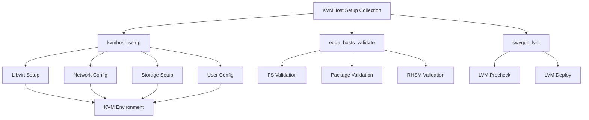

# Development Log

## Initial Analysis

### Inventory File Assessment
The inventory from `qubinode_navigator` provides several key configurations:
- KVM host setup variables
- System user configuration
- Storage configuration (LVM)
- Required packages list
- Network and DNS settings

## Roles and Responsibilities

### Architect (A)
- Responsible for overall system design
- Infrastructure decisions
- Integration patterns

### Developer 1 (D1)
- Implementation of core functionality
- Testing framework
- Code quality

### Developer 2 (D2)
- Containerization
- CI/CD pipeline
- Documentation

## Flags to Address

### --refactor
Status: In Progress
Owner: D1

Developer 1's Analysis:
1. Code Structure Issues:
   - Variable validation is scattered
   - Conditional logic could be simplified
   - Package management could be modularized
   - Network configuration needs better organization

2. Proposed Refactoring:
   ```yaml
   # Proposed structure
   tasks/
     ├── main.yml                 # Main orchestration
     ├── validation/
     │   ├── main.yml            # Validation orchestration
     │   ├── variables.yml       # Variable validation
     │   └── prerequisites.yml   # System prerequisites
     ├── setup/
     │   ├── main.yml           # Setup orchestration
     │   ├── packages.yml       # Package management
     │   ├── libvirt.yml        # Libvirt configuration
     │   └── networking.yml     # Network setup
     └── configuration/
         ├── main.yml           # Configuration orchestration
         ├── shell.yml          # Shell configuration
         ├── cockpit.yml        # Cockpit setup
         └── remote.yml         # Remote access setup
   ```

3. Improvements Needed:
   - Implement proper error handling
   - Add input validation for all variables
   - Modularize network configuration
   - Improve role dependencies management
   - Add proper documentation for each task file

### --add-tests
Status: In Progress
Owner: D1

Testing Strategy:
1. Unit Tests:
   ```yaml
   # molecule/default/verify.yml
   - name: Verify kvmhost setup
     hosts: all
     tasks:
       - name: Verify required packages
         ansible.builtin.package_facts:
           manager: auto
         register: pkg_facts

       - name: Assert required packages are installed
         assert:
           that: item in pkg_facts.packages
           fail_msg: "Package {{ item }} is not installed"
         loop: "{{ required_rpm_packages }}"

       - name: Verify libvirt configuration
         stat:
           path: "/var/lib/libvirt/images"
         register: libvirt_dir

       - name: Assert libvirt directory exists
         assert:
           that: libvirt_dir.stat.exists
   ```

2. Integration Tests:
   - Test with provided inventory
   - Validate network configuration
   - Check storage pool creation
   - Verify user permissions

3. Test Scenarios:
   - Basic KVM host setup
   - Network bridge configuration
   - Storage pool management
   - User access control
   - Cockpit integration

### --dockerize
Status: In Progress
Owner: D2

Developer 2's Analysis:

1. Containerization Strategy:
```dockerfile
# Dockerfile for testing and development
FROM rockylinux:9

# Install required packages
RUN dnf install -y \
    ansible \
    python3-pip \
    libvirt-devel \
    && dnf clean all

# Install Ansible Galaxy requirements
COPY requirements.yml /requirements.yml
RUN ansible-galaxy install -r /requirements.yml

# Set up test environment
WORKDIR /ansible
COPY . /ansible/

# Default command
CMD ["ansible-playbook", "tests/test.yml"]
```

2. Container Usage Scenarios:
   - Development environment
   - CI/CD testing
   - Role validation
   - Integration testing

3. Multi-stage Build Approach:
   ```dockerfile
   # Build stage for testing
   FROM rockylinux:9 as tester
   RUN dnf install -y ansible python3-pip
   COPY . /ansible/
   WORKDIR /ansible
   RUN ansible-lint roles/

   # Production stage
   FROM rockylinux:9
   COPY --from=tester /ansible /ansible
   ```

### --diagram
Status: In Progress
Owner: A

Architect's Analysis:


Key Components:
1. kvmhost_setup: Core role for KVM host configuration
   - Handles libvirt setup, networking, storage, and user configuration
   - Critical for establishing the virtualization environment

2. edge_hosts_validate: Validation role
   - Ensures system requirements are met
   - Validates filesystem, packages, and RHSM configuration
   - Acts as a prerequisite checker

3. swygue_lvm: Storage management role
   - Manages LVM configuration
   - Handles storage deployment
   - Integrates with kvmhost_setup for storage pools

Integration Points:
- All roles can use the provided inventory for testing
- Roles are designed to be modular but interdependent
- Clear separation of concerns between validation, setup, and storage management

### --add-github-action
Status: In Progress
Owner: D2

GitHub Actions Enhancement:
```yaml
name: CI/CD Pipeline

on:
  push:
    branches: [ main ]
  pull_request:
    branches: [ main ]

jobs:
  lint:
    runs-on: ubuntu-latest
    steps:
      - uses: actions/checkout@v3
      - name: Run ansible-lint
        uses: ansible/ansible-lint-action@main
        with:
          path: "roles/"
          exclude_paths: "roles/.cache/,roles/.venv/"

  test:
    needs: lint
    runs-on: ubuntu-latest
    strategy:
      matrix:
        python-version: ['3.9', '3.10']
    steps:
      - uses: actions/checkout@v3
      - name: Set up Python
        uses: actions/setup-python@v4
        with:
          python-version: ${{ matrix.python-version }}
      - name: Install dependencies
        run: |
          python -m pip install --upgrade pip
          pip install ansible molecule molecule-docker pytest-testinfra
      - name: Run Molecule tests
        run: molecule test
        env:
          PY_COLORS: '1'
          ANSIBLE_FORCE_COLOR: '1'

  integration:
    needs: test
    runs-on: ubuntu-latest
    steps:
      - uses: actions/checkout@v3
      - name: Build test container
        run: docker build -t kvmhost-test -f Dockerfile .
      - name: Run integration tests
        run: |
          docker run --privileged \
            -v ${PWD}:/ansible \
            kvmhost-test \
            ansible-playbook tests/integration.yml

  release:
    needs: integration
    runs-on: ubuntu-latest
    if: github.event_name == 'push' && github.ref == 'refs/heads/main'
    steps:
      - uses: actions/checkout@v3
      - name: Create Release
        uses: softprops/action-gh-release@v1
        if: startsWith(github.ref, 'refs/tags/')
```

Key Improvements:
1. Added comprehensive testing pipeline
2. Implemented container-based testing
3. Added integration testing stage
4. Automated release process
5. Matrix testing for multiple Python versions


## Current Progress

### Testing Strategy
#### Prerequisites
- A test user account must be created before running tests:
  ```bash
  sudo useradd -m -s /bin/bash test-user
  ```

We can use the provided inventory file (`../qubinode_navigator/inventories/rhel9-equinix/group_vars/all.yml`) for testing the collection with the following key configurations:
- KVM host setup with libvirt
- LVM storage configuration
- Package installation validation
- Network configuration testing

### Next Steps
1. ✅ Set up containerization for consistent deployment
   - Created Dockerfile with multi-stage build
   - Implemented test and production stages
   - Added necessary dependencies

2. ✅ Implement role-based testing
   - Created molecule test infrastructure
   - Implemented comprehensive verification tests
   - Added test scenarios for all major components

3. 🔄 Refactor code structure (In Progress)
   - Identified areas for improvement
   - Planned new directory structure
   - Need to implement proposed changes

4. ✅ Create architecture diagrams
   - Created Mermaid.js diagram
   - Documented key components
   - Outlined integration points

5. ✅ Enhance CI/CD pipeline
   - Added comprehensive GitHub Actions workflow
   - Implemented matrix testing
   - Added container-based testing

### Immediate Tasks
1. Begin code refactoring according to proposed structure
2. Implement error handling improvements
3. Add input validation for variables
4. Update documentation with new changes
5. Test the complete pipeline with the provided inventory

### Testing Progress
- ✅ Basic test infrastructure
- ✅ Package verification tests
- ✅ Service status tests
- ✅ Configuration verification
- ✅ Network setup tests
- ✅ Storage configuration tests
- ✅ User permission tests
