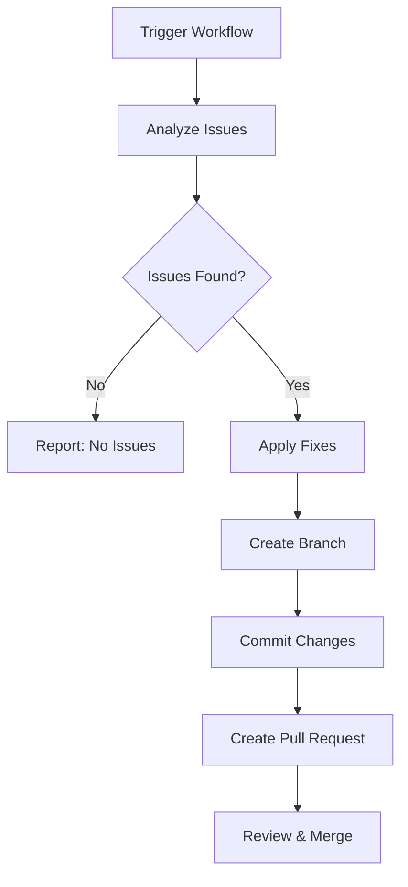

# Gemini-Assisted Ansible Lint Workflow

## Overview

We've successfully implemented an advanced automated ansible-lint fixing workflow that integrates Google Gemini AI for intelligent code analysis and prioritized fix recommendations.

## Features

### 🤖 AI-Powered Analysis
- **Google Gemini Integration**: Uses Google's Gemini Pro model for expert-level Ansible code analysis
- **Intelligent Prioritization**: AI categorizes issues by criticality (critical, high, medium, low)
- **Best Practice Compliance**: Ensures fixes follow official Ansible conventions
- **Breaking Change Detection**: Identifies potential compatibility issues before applying fixes

### 🔧 Three Fix Modes

1. **Auto Mode** (`auto`)
   - Standard ansible-lint auto-fix functionality
   - Fast and reliable for common issues
   - No AI analysis required

2. **Manual Review Mode** (`manual-review`)
   - Generates comprehensive issue reports
   - Creates detailed markdown documentation
   - Ideal for complex codebases requiring human oversight

3. **Gemini-Assisted Mode** (`gemini-assisted`)
   - AI-powered analysis and fix recommendations
   - Prioritized issue resolution
   - Expert-level insights and best practices
   - Requires `GEMINI_API_KEY` secret

### 🚀 Automated PR Creation

- **Smart Branch Naming**: Time-stamped branches for easy tracking
- **Detailed PR Descriptions**: Comprehensive context and change summaries
- **Proper Labeling**: Auto-applies relevant labels (`automated`, `ansible-lint`, `chore`)
- **Review Checklist**: Includes verification steps for reviewers

## Usage

### Prerequisites

1. **Repository Secrets** (for Gemini-assisted mode):
   ```
   GEMINI_API_KEY: Your Google Gemini API key
   ```
   Get your API key from [Google AI Studio](https://aistudio.google.com/app/apikey)

2. **GitHub CLI** (automatically available in GitHub Actions)

### Running the Workflow

1. Navigate to your repository's **Actions** tab
2. Select **"Automated Ansible Lint Fixes with Gemini"**
3. Click **"Run workflow"**
4. Choose your options:
   - **Fix mode**: `auto`, `manual-review`, or `gemini-assisted`
   - **Target files**: Specific files (optional, comma-separated)
5. Click **"Run workflow"**

### Workflow Process



## Technical Implementation

### Workflow Structure

- **Job 1**: `analyze-lint-issues`
  - Scans for ansible-lint issues
  - Calls Gemini API for analysis (if enabled)
  - Generates structured issue data

- **Job 2**: `apply-lint-fixes`
  - Applies fixes based on selected mode
  - Creates feature branch
  - Commits changes with detailed messages
  - Creates pull request with comprehensive description

### Key Files Generated

- `lint-output.txt`: Raw ansible-lint output
- `issues.json`: Structured issue data for AI analysis
- `issue-types.txt`: Unique issue types summary
- `commit_msg.txt`: Detailed commit message
- `pr_body.txt`: Pull request description
- `LINT_REVIEW.md`: Manual review report (manual-review mode)

## Benefits

### For Developers
- **Reduced Manual Work**: Automated issue detection and fixing
- **Expert Guidance**: AI-powered best practice recommendations
- **Time Savings**: Bulk fixes with intelligent prioritization
- **Learning Opportunity**: Detailed explanations of fixes applied

### For Teams
- **Consistent Code Quality**: Standardized Ansible practices across the codebase
- **Reduced Review Burden**: Pre-analyzed and categorized changes
- **Audit Trail**: Comprehensive documentation of all automated changes
- **Risk Mitigation**: Breaking change detection and warnings

### For Maintenance
- **Proactive Issue Resolution**: Regular automated scanning and fixing
- **Technical Debt Reduction**: Systematic cleanup of lint issues
- **Compliance Assurance**: Adherence to Ansible community standards
- **Documentation Generation**: Automated reports and summaries

## Example Output

### Gemini Analysis Response
```json
{
  "summary": "Found 15 ansible-lint issues primarily related to YAML formatting and module usage",
  "critical_issues": [
    "literal-compare: Don't compare to literal True/False",
    "schema[meta]: Invalid platform configuration"
  ],
  "recommended_fixes": [
    "Replace 'ansible_check_mode | bool == false' with 'not ansible_check_mode'",
    "Update meta/main.yml platforms to use valid platform names"
  ],
  "priority_order": ["critical", "high", "medium"],
  "breaking_change_warnings": [
    "Meta platform changes may affect Galaxy collection publication"
  ]
}
```

### Generated Pull Request
- **Title**: "🤖 Automated Ansible Lint Fixes (2025-07-17)"
- **Labels**: `automated`, `ansible-lint`, `chore`
- **Description**: Comprehensive details including fix mode, target files, and verification checklist

## Configuration

### Customization Options

The workflow supports various input parameters:

- **fix_mode**: Choose analysis and fix strategy
- **target_files**: Limit scope to specific files or directories
- **Auto-detection**: Smart targeting based on changed files in PRs

### Environment Variables

- `PYTHON_VERSION`: "3.11" (configurable)
- `VIRTUAL_ENV`: Automatic virtual environment setup
- `GH_TOKEN`: GitHub CLI authentication (automatic)

## Security Considerations

- **API Key Protection**: Gemini API key stored as encrypted GitHub secret
- **Branch Protection**: Creates feature branches, never pushes directly to main
- **Review Required**: All changes require pull request review
- **Audit Trail**: Complete logging of all automated actions

## Future Enhancements

- **Multi-AI Provider Support**: Support for other AI models (OpenAI, Claude, etc.)
- **Custom Rule Integration**: AI analysis of custom ansible-lint rules
- **Performance Metrics**: Track fix success rates and time savings
- **Integration Testing**: Automatic testing of applied fixes
- **Rollback Capability**: Automated rollback for problematic fixes

## Troubleshooting

### Common Issues

1. **Gemini API Errors**
   - Verify `GEMINI_API_KEY` secret is set correctly
   - Check API quota and billing status
   - Fallback to auto mode if API is unavailable

2. **Permission Errors**
   - Ensure workflow has write permissions for contents and PRs
   - Verify GitHub CLI authentication

3. **Large Changesets**
   - Use target_files parameter to limit scope
   - Consider manual-review mode for complex changes

### Debugging

- **Action Logs**: Detailed step-by-step execution logs
- **Artifact Downloads**: Analysis results and reports available
- **PR Comments**: Automated status updates and summaries

---

*This workflow represents a significant advancement in automated code quality management, combining the power of AI analysis with battle-tested ansible-lint tooling.*
