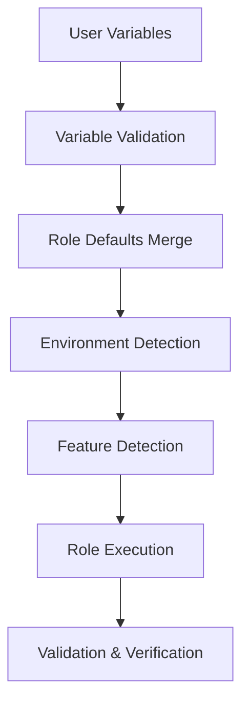

# Collection Architecture Overview

This document explains the high-level architecture of the Qubinode KVM Host Setup Collection, the design principles that guide its structure, and how the various components work together to provide a comprehensive KVM host management solution.

## 🏗️ Architectural Philosophy

The collection is built on several key architectural principles:

### 1. Modular Design (ADR-0002)
The collection follows a modular architecture where each role has a specific, well-defined responsibility. This approach provides:
- **Separation of Concerns**: Each role focuses on one aspect of KVM host setup
- **Reusability**: Roles can be used independently or in combination
- **Maintainability**: Changes to one component don't affect others
- **Testability**: Each role can be tested in isolation

### 2. Layered Architecture
The collection implements a layered architecture with clear dependencies:

```
┌─────────────────────────────────────────┐
│           Orchestration Layer           │
│            (kvmhost_setup)              │
├─────────────────────────────────────────┤
│          Application Layer              │
│    (cockpit, user_config, storage)     │
├─────────────────────────────────────────┤
│         Infrastructure Layer           │
│      (libvirt, networking, base)       │
├─────────────────────────────────────────┤
│           Foundation Layer              │
│        (OS, hardware, services)        │
└─────────────────────────────────────────┘
```

### Network Topology

The collection creates a bridged networking stack that connects VMs to the physical network through NetworkManager:

```
┌──────────┐  ┌──────────┐        ┌──────────┐
│   VM 1   │  │   VM 2   │  ...   │   VM N   │
│ (vnetX)  │  │ (vnetX)  │        │ (vnetX)  │
└────┬─────┘  └────┬─────┘        └────┬─────┘
     │              │                   │
     │    ┌─────────┴───────────────────┘
     │    │   libvirt networks
     │    │   (bridge mode / NAT mode)
┌────┴────┴──────────────────────────────────┐
│        NetworkManager Bridge               │
│              (qubibr0)                     │
│                                            │
│  ┌──────────────────────────────────────┐  │
│  │  Bridge Slave: Physical NIC (e.g.   │  │
│  │  eno1 / ens3 / enp0s25)            │  │
│  └──────────────────────────────────────┘  │
└─────────────────┬──────────────────────────┘
                  │
          Physical Network / Gateway
```

- **Bridge mode** (default) – VMs appear as peers on the physical LAN; each VM can obtain a DHCP lease from the upstream router.
- **NAT mode** – libvirt manages a private subnet and performs NAT for outbound traffic; useful for isolated lab environments.

The bridge name, slave device, and IP settings are all driven by inventory variables (`qubinode_bridge_name`, `kvm_host_interface`, etc.).

### 3. Configuration-Driven Approach
The collection uses extensive configuration variables to adapt to different environments without code changes:
- **Environment Flexibility**: Same code works across dev, staging, production
- **Platform Abstraction**: Supports multiple RHEL-based distributions
- **Feature Toggles**: Enable/disable features based on requirements

## 🧩 Component Architecture

### Core Roles and Their Responsibilities

#### Foundation Layer
**kvmhost_base**
- **Purpose**: Provides foundational system configuration
- **Responsibilities**: 
  - OS detection and validation
  - Base package installation
  - EPEL repository configuration
  - Essential service setup
- **Dependencies**: None (foundation role)

#### Infrastructure Layer
**kvmhost_networking**
- **Purpose**: Network infrastructure setup
- **Responsibilities**:
  - Network bridge creation and configuration
  - Interface management
  - Network validation and testing
- **Dependencies**: kvmhost_base

**kvmhost_libvirt**
- **Purpose**: Virtualization infrastructure
- **Responsibilities**:
  - Libvirt daemon configuration
  - Virtual network management
  - Hardware feature detection
  - Performance tuning
- **Dependencies**: kvmhost_base, kvmhost_networking

#### Application Layer
**kvmhost_storage**
- **Purpose**: Storage management
- **Responsibilities**:
  - Storage pool creation and management
  - LVM configuration
  - Performance optimization
  - Backup and snapshot management
- **Dependencies**: kvmhost_base, kvmhost_libvirt

**kvmhost_cockpit**
- **Purpose**: Web-based management interface
- **Responsibilities**:
  - Cockpit installation and configuration
  - SSL certificate management
  - User access control
  - Module configuration
- **Dependencies**: kvmhost_base, kvmhost_libvirt

**kvmhost_user_config**
- **Purpose**: User environment configuration
- **Responsibilities**:
  - User account management
  - Shell environment setup
  - SSH configuration
  - Development tools installation
- **Dependencies**: kvmhost_base

#### Orchestration Layer
**kvmhost_setup**
- **Purpose**: Main orchestration and coordination
- **Responsibilities**:
  - Role execution coordination
  - Variable validation
  - Feature detection
  - Performance optimization
- **Dependencies**: All other roles

### Validation and Support Roles

**edge_hosts_validate**
- **Purpose**: System validation and compliance checking
- **Responsibilities**:
  - Filesystem validation
  - Package validation
  - RHSM registration validation
- **Dependencies**: None (standalone)

**swygue_lvm**
- **Purpose**: Advanced LVM management
- **Responsibilities**:
  - LVM precheck and validation
  - LVM deployment and configuration
- **Dependencies**: None (standalone)

## 🔄 Data Flow Architecture

### Configuration Flow


### Execution Flow
1. **Initialization**: Variable validation and environment detection
2. **Foundation**: Base system configuration (kvmhost_base)
3. **Infrastructure**: Network and virtualization setup
4. **Application**: Storage, web interface, user configuration
5. **Optimization**: Performance tuning and feature enablement
6. **Validation**: System validation and health checks

### Dependency Resolution
The collection automatically resolves role dependencies:

```yaml
# Dependency chain example
kvmhost_setup:
  depends_on:
    - kvmhost_base
    - kvmhost_networking  # requires kvmhost_base
    - kvmhost_libvirt     # requires kvmhost_base, kvmhost_networking
    - kvmhost_storage     # requires kvmhost_base, kvmhost_libvirt
    - kvmhost_cockpit     # requires kvmhost_base, kvmhost_libvirt
    - kvmhost_user_config # requires kvmhost_base
```

## 🎯 Design Patterns

### 1. Idempotency Pattern (ADR-0004)
Every task is designed to be idempotent:
- **Safe Re-execution**: Can be run multiple times safely
- **State Convergence**: Brings system to desired state regardless of current state
- **Change Detection**: Only makes changes when necessary

### 2. Validation Pattern
Comprehensive validation at multiple levels:
- **Input Validation**: Variables and prerequisites
- **Runtime Validation**: Service status and configuration
- **Post-Configuration Validation**: Functionality testing

### 3. Feature Detection Pattern
Automatic detection and adaptation:
- **Hardware Capabilities**: CPU features, virtualization support
- **OS Capabilities**: Distribution-specific features
- **Environment Context**: Container vs. bare metal

### 4. Configuration Template Pattern
Standardized configuration management:
- **Template-Based**: Jinja2 templates for configuration files
- **Variable-Driven**: Configuration through variables
- **Environment-Aware**: Adapts to different environments

## 🔐 Security Architecture

### Security Layers
1. **Access Control**: User and group management
2. **Network Security**: Firewall configuration and network isolation
3. **Service Security**: Secure service configuration
4. **File Security**: Proper permissions and SELinux contexts

### Security Principles
- **Secure by Default**: Secure configurations out of the box
- **Principle of Least Privilege**: Minimal required permissions
- **Defense in Depth**: Multiple security layers
- **Audit Trail**: Logging and monitoring capabilities

## 🚀 Scalability Architecture

### Horizontal Scaling
- **Multi-Host Support**: Same configuration across multiple hosts
- **Inventory-Based**: Ansible inventory for host management
- **Parallel Execution**: Concurrent role execution where possible

### Vertical Scaling
- **Resource Optimization**: Performance tuning for larger workloads
- **Hardware Utilization**: Efficient use of available resources
- **Storage Scaling**: Flexible storage pool management

## 🔧 Integration Architecture

### External System Integration
- **Ansible Ecosystem**: Leverages community collections
- **Container Platforms**: Podman/Docker integration for testing
- **Monitoring Systems**: Integration points for monitoring tools
- **Backup Systems**: Hooks for backup and disaster recovery

### API Integration
- **Libvirt API**: Direct integration with libvirt management
- **NetworkManager API**: Network configuration through NetworkManager
- **System APIs**: Integration with systemd and other system services

## 📊 Quality Architecture

### Testing Strategy
- **Unit Testing**: Individual role testing with Molecule
- **Integration Testing**: Multi-role interaction testing
- **System Testing**: End-to-end functionality validation
- **Performance Testing**: Resource usage and performance validation

### Quality Assurance
- **Automated Linting**: Ansible-lint and YAML-lint integration
- **Security Scanning**: Automated vulnerability scanning
- **Compliance Checking**: ADR compliance validation
- **Documentation Validation**: Documentation accuracy checking

## 🔄 Evolution and Maintenance

### Architectural Evolution
The architecture has evolved to support:
- **RHEL 9/10 Support**: Extended platform support (ADR-0008)
- **Container Testing**: Modern testing approaches (ADR-0012)
- **Automated Releases**: CI/CD integration (ADR-0014)
- **Performance Optimization**: Enterprise-grade performance

### Maintenance Strategy
- **Backward Compatibility**: Maintaining compatibility across versions
- **Deprecation Management**: Graceful deprecation of old features
- **Documentation Synchronization**: Keeping docs in sync with code
- **Community Feedback Integration**: Incorporating user feedback

## 🎓 Architectural Benefits

### For Users
- **Simplicity**: Complex tasks made simple through automation
- **Reliability**: Consistent, predictable behavior
- **Flexibility**: Configurable for different use cases
- **Maintainability**: Easy to understand and modify

### For Developers
- **Modularity**: Clear separation of concerns
- **Testability**: Comprehensive testing framework
- **Extensibility**: Easy to add new features
- **Documentation**: Well-documented design decisions

### For Operations
- **Automation**: Reduced manual intervention
- **Monitoring**: Built-in health checks and validation
- **Scalability**: Supports growth and expansion
- **Security**: Security best practices built-in

## 🔗 Related Documentation

- **Design Decisions**: [Architecture Decision Records](../../adrs/)
- **Implementation**: [Modular Role Design](modular-role-design.md)
- **Security**: [Security Model](security-model.md)
- **Performance**: [Performance Architecture](performance-architecture.md)

---

*This overview provides the conceptual foundation for understanding the collection. For specific implementation details, see the reference documentation and individual role explanations.*
