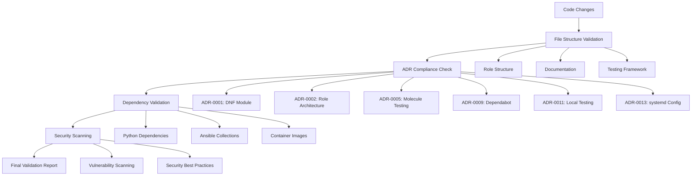

# Automation Philosophy and Framework

This document explains the comprehensive automation philosophy that guides the Qubinode KVM Host Setup Collection's development, testing, and deployment processes.

## 🎯 Automation Philosophy

### Core Principles

#### 1. Automation-First Mindset
Every process that can be automated should be automated:
- **Repetitive Tasks**: Eliminate manual repetition
- **Error-Prone Processes**: Reduce human error through automation
- **Quality Gates**: Automated validation and compliance checking
- **Consistency**: Ensure consistent execution across environments

#### 2. Quality Through Automation
Automation serves quality assurance:
- **Continuous Validation**: Automated testing at every stage
- **Compliance Checking**: Automated ADR compliance validation
- **Security Scanning**: Automated vulnerability detection
- **Documentation Validation**: Automated documentation accuracy checking

#### 3. Developer Experience Enhancement
Automation improves developer productivity:
- **Reduced Cognitive Load**: Automation handles routine tasks
- **Fast Feedback**: Quick validation of changes
- **Consistent Environments**: Automated environment setup
- **Focus on Value**: Developers focus on features, not process

## 🏗️ Automation Framework Architecture

### Validation Layers



### Core Components

#### 1. ADR Compliance Automation
**Purpose**: Ensure architectural decisions are properly implemented
**Implementation**: `scripts/adr-compliance-checker.sh`
**Validation**:
- ADR-0001: DNF module usage validation
- ADR-0002: Role structure compliance
- ADR-0005: Molecule testing presence
- ADR-0009: Dependabot configuration
- ADR-0011: Local testing requirements
- ADR-0013: Systemd configuration standards

#### 2. File Structure Validation
**Purpose**: Maintain consistent project organization
**Implementation**: `scripts/validate-file-structure.sh`
**Checks**:
- Role directory structure compliance
- Documentation completeness
- Testing framework presence
- Configuration file standards

#### 3. Dependency Management Automation
**Purpose**: Secure and up-to-date dependency management
**Implementation**: Multiple automated processes
**Components**:
- Dependabot configuration for automated updates
- Security vulnerability scanning
- Dependency validation pipeline
- License compliance checking

#### 4. Testing Automation
**Purpose**: Comprehensive quality validation
**Implementation**: Multi-layered testing approach
**Levels**:
- Unit testing (individual roles)
- Integration testing (role interactions)
- System testing (end-to-end functionality)
- Security testing (vulnerability scanning)

## 🔄 Automation Workflows

### Development Workflow Automation

#### Pre-Commit Automation
```bash
# Automated pre-commit validation
1. File structure validation
2. ADR compliance checking
3. Lint validation (Ansible, YAML)
4. Local Molecule testing
5. Security scanning
6. Documentation validation
```

#### Continuous Integration Automation
```yaml
# GitHub Actions workflow automation
triggers:
  - push: [main, develop]
  - pull_request: [main]
  - schedule: "0 2 * * 1"  # Weekly

validation_pipeline:
  - file_structure_validation
  - adr_compliance_check
  - dependency_validation
  - security_scanning
  - molecule_testing
  - integration_testing
```

#### Release Automation
```yaml
# Automated release process
triggers:
  - dependabot_merge: security updates
  - manual_trigger: feature releases
  - scheduled: weekly maintenance releases

release_pipeline:
  - version_bump
  - changelog_generation
  - galaxy_build
  - galaxy_publish
  - github_release
  - notification
```

### Quality Assurance Automation

#### Code Quality Gates
1. **Syntax Validation**: Automated YAML and Ansible syntax checking
2. **Lint Compliance**: Ansible-lint and yamllint validation
3. **Security Scanning**: Bandit, safety, and custom security checks
4. **Performance Testing**: Automated performance regression testing
5. **Documentation Validation**: Automated documentation accuracy checking

#### Compliance Automation
1. **ADR Compliance**: Automated checking of architectural decision implementation
2. **Standards Compliance**: Coding standards and conventions validation
3. **Security Compliance**: Security best practices validation
4. **License Compliance**: Dependency license compatibility checking

## 🎯 Automation Benefits

### For Developers

#### Productivity Enhancement
- **Reduced Manual Work**: Automation handles routine tasks
- **Fast Feedback**: Quick validation of changes
- **Consistent Quality**: Automated quality standards enforcement
- **Focus on Innovation**: More time for feature development

#### Error Prevention
- **Early Detection**: Issues caught before they reach production
- **Consistent Validation**: Same checks applied everywhere
- **Comprehensive Coverage**: Multiple validation layers
- **Automated Remediation**: Some issues fixed automatically

### For Users

#### Reliability
- **Consistent Quality**: Every release meets quality standards
- **Reduced Bugs**: Comprehensive testing catches issues early
- **Predictable Behavior**: Automated testing ensures consistent behavior
- **Security**: Automated security scanning and updates

#### Faster Delivery
- **Automated Releases**: Faster delivery of updates and fixes
- **Continuous Improvement**: Regular automated improvements
- **Reduced Downtime**: Better quality reduces production issues

### For Operations

#### Operational Excellence
- **Automated Monitoring**: Continuous health checking
- **Proactive Maintenance**: Automated dependency updates
- **Incident Prevention**: Issues caught before they impact users
- **Compliance Assurance**: Automated compliance validation

## 🔧 Implementation Strategy

### Automation Maturity Levels

#### Level 1: Basic Automation
- Manual processes with some automated checks
- Basic CI/CD pipeline
- Simple dependency management

#### Level 2: Enhanced Automation (Current)
- Comprehensive automated validation
- Advanced CI/CD with multiple quality gates
- Automated dependency management with security scanning
- Automated release processes

#### Level 3: Intelligent Automation (Future)
- AI-assisted code review and optimization
- Predictive quality analysis
- Automated performance optimization
- Self-healing infrastructure

### Automation Tools and Technologies

#### Core Automation Stack
- **GitHub Actions**: CI/CD orchestration
- **Dependabot**: Dependency management
- **Molecule**: Testing automation
- **Ansible Lint**: Code quality automation
- **Bandit**: Security scanning automation

#### Supporting Tools
- **Bash Scripts**: Custom automation logic
- **Python Scripts**: Complex validation logic
- **Container Technology**: Isolated testing environments
- **Git Hooks**: Local automation triggers

## 📊 Automation Metrics

### Quality Metrics
- **Test Coverage**: >90% role coverage with Molecule tests
- **Lint Compliance**: 100% lint compliance required
- **Security Score**: Zero high/critical vulnerabilities
- **ADR Compliance**: 100% compliance with accepted ADRs

### Performance Metrics
- **Build Time**: <30 minutes for full validation
- **Test Execution**: <5 minutes per role
- **Release Frequency**: Weekly automated releases
- **Issue Resolution**: <24 hours for critical issues

### Developer Experience Metrics
- **Setup Time**: <15 minutes for development environment
- **Feedback Time**: <5 minutes for local validation
- **Contribution Time**: <1 hour from idea to PR
- **Review Time**: <48 hours for PR review

## 🚨 Automation Challenges and Solutions

### Challenge: Automation Complexity
**Problem**: Complex automation can be hard to maintain
**Solution**: 
- Modular automation scripts
- Clear documentation for each automation component
- Regular automation health checks

### Challenge: False Positives
**Problem**: Automated checks may flag valid code
**Solution**:
- Tunable validation rules
- Exception handling mechanisms
- Human override capabilities

### Challenge: Automation Drift
**Problem**: Automation may become outdated
**Solution**:
- Regular automation review cycles
- Automated testing of automation itself
- Version control for automation scripts

## 🔄 Future Automation Roadmap

### Short-Term (Next 3 months)
- Enhanced AI-assisted code review
- Automated performance regression testing
- Improved security scanning integration
- Advanced dependency conflict resolution

### Medium-Term (Next 6 months)
- Predictive quality analysis
- Automated documentation generation
- Intelligent test case generation
- Self-optimizing CI/CD pipelines

### Long-Term (Next 12 months)
- Machine learning-based quality prediction
- Automated architecture optimization
- Self-healing automation infrastructure
- Intelligent resource optimization

## 🔗 Related Documentation

- **Implementation**: [CI/CD Pipeline Design](cicd-pipeline-design.md)
- **Testing**: [Testing Framework Selection](testing-framework-selection.md)
- **Quality**: [Quality Assurance Strategy](quality-assurance-strategy.md)
- **ADRs**: [Architecture Decision Records](architecture-decisions/)

---

*This explanation covers the automation philosophy and framework. For specific implementation details, see the how-to guides and reference documentation.*
