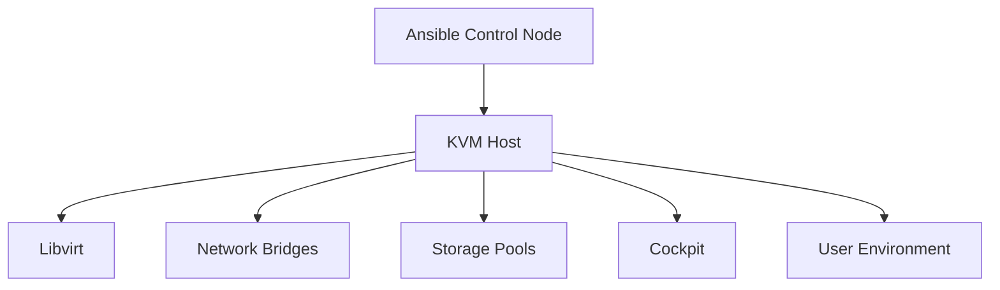

# Qubinode KVM Host Setup Collection

## Overview

The Qubinode KVM Host Setup Collection is an Ansible collection designed to automate the setup and configuration of KVM virtualization hosts. It provides a comprehensive set of roles and playbooks for managing all aspects of KVM host configuration.

## Key Features

- Automated KVM host provisioning
- Network configuration management
- Storage pool setup
- Cockpit web interface configuration
- User environment customization
- System validation and verification

## Architecture

## Components

1. **kvmhost_setup**: Main role for KVM host configuration
2. **edge_hosts_validate**: Validation role for edge hosts
3. **swygue_lvm**: LVM configuration role

## Supported Platforms

- Rocky Linux 8+
- CentOS Stream 8+
- RHEL 8+

## Requirements

- Ansible 2.9+
- Python 3.6+
- Libvirt
- Cockpit
